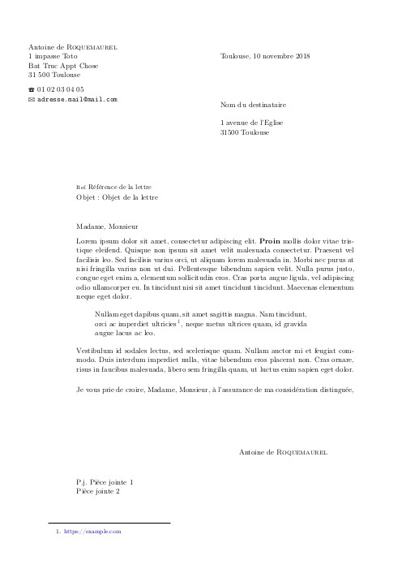

Template Lettre pour Pandoc
=====================

Un template permettant de rédiger des courriers en français en utilisant pandoc. 

- default.ins contient les informations de l'émetteur
- lettre.cls contient le thème LaTeX
- template-lettre.tex Thème pandoc permettant la rédaction de la lettre
- lettre.md contient un example de courrier rédigé en markdown
- Makefile le makefile permettant de compiler le pdf : `make` créera le fichier lettre.pdf

# Thème LaTeX
Le thème est également disponible pour rédiger un courrier en LaTeX pur sur le repository [aroquemaurel/LaTeX-Lettre-Template](https://github.com/aroquemaurel/LaTeX-Lettre-Template).

